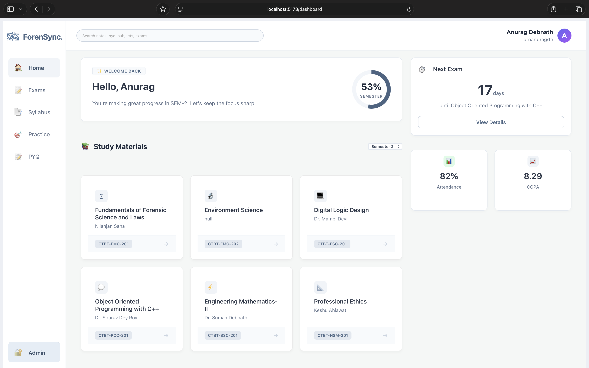
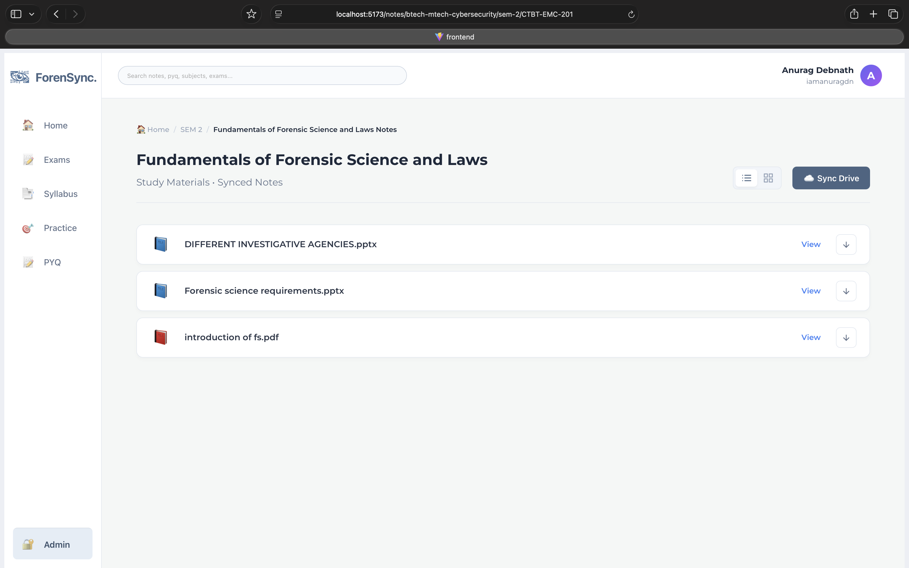
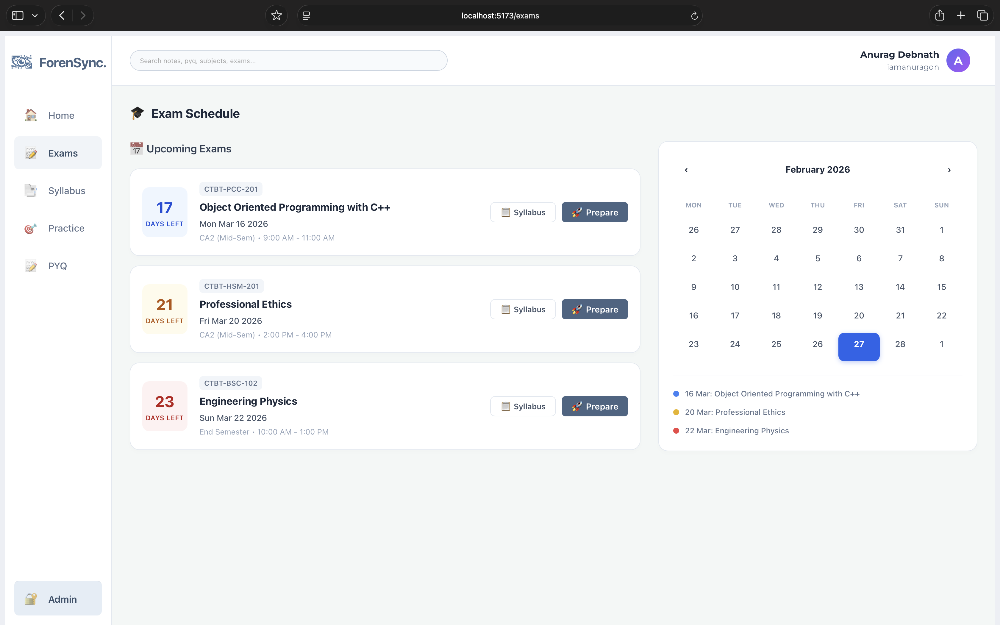
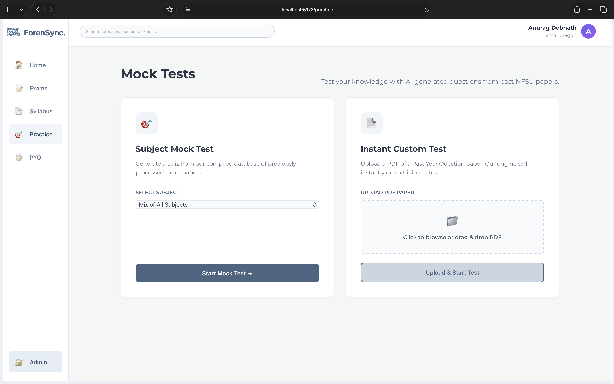

# ForenSync

> **A unified academic dashboard bridging the gap between scattered campus resources and seamless student productivity.**



## 🚀 The Problem
University students constantly juggle multiple platforms to find what they need: WhatsApp groups for announcements, messy Google Drive folders for notes, and scattered PDFs for syllabus tracking. It's disorganized and stressful, especially during exam season.

## 💡 The Solution: ForenSync
ForenSync is a centralized, premium academic platform built to organize the chaos. It intelligently syncs with faculty Google Drives, parses syllabus data, and tracks upcoming assessments—all wrapped in a sleek, modern, and lightning-fast UI.

### ✨ Key Features
* ☁️ **Google Drive Auto-Sync:** A dedicated Admin Console that allows faculty to upload files while automatically syncing metadata to Firestore and pulling direct view/download links from Google Drive.
* 📚 **Dynamic Syllabus Engine:** A centralized, fully responsive syllabus viewer that dynamically routes and fetches specific unit and topic data from the backend.
* 📅 **Exam & Assessment Tracker:** A real-time dashboard calculating total exams, days left until the next paper, and subject-specific countdowns.
* 🗂️ **Organized PYQs & Notes:** Automatically categorized Past Year Questions (PYQs) and unit notes with a beautiful list/grid view toggle.
* 🎨 **Premium UI/UX:** Built with a focus on psychological ease—utilizing clean flexbox layouts, soft pastel status indicators, and intuitive navigation.

---

## 🛠️ Tech Stack

**Frontend:**
* React.js (Vite)
* React Router (Dynamic Routing)
* Vanilla CSS (Custom responsive flexbox/grid architecture)

**Backend & Services:**
* Node.js & Express
* Firebase / Firestore (NoSQL Database for Syllabus & File Metadata)
* Google Drive API (Cloud Storage Integration)

---

## 💻 Getting Started (Local Setup for Judges)

Want to run ForenSync locally? Follow these steps:

### 1. Clone the Repository
```bash
git clone https://github.com/iamanuragdn/ForenSync.git
cd ForenSync
```
### 2. Setup the Backend
```bash
cd backend
npm install
(Note: You will need to create a .env file in the backend directory with the necessary Firebase Admin credentials and Google Drive API keys. See .env.example for the required variables.)
```

# Start the backend server (runs on port 5001)
npm start
```bash
### 3. Setup the Frontend

Open a new terminal window and navigate to the frontend folder:

```bash
cd frontend
npm install
```
```bash
# Start the Vite development server
npm run dev
```

The app will be running at http://localhost:5173.

## 📸 Sneak Peek

### 🏠 Main Dashboard


### 📚 Study Materials & Notes


### 📚 Exam


### 🎯 Mock Test


### ⚙️ Admin Console


---

## 👨‍💻 Built By

* **Anurag Debnath**
* **Anindya Bhar**
* **Reejit Maji**
* **Priyangsha Paul**
* **Rounak Kundu**

*Built with ❤️ and way too much caffeine for the **NFSU Smart Campus Hackathon**.*